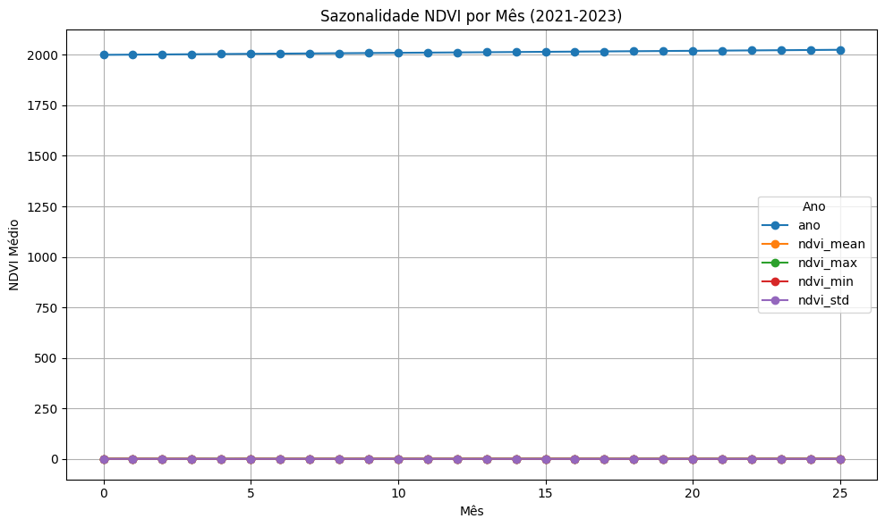
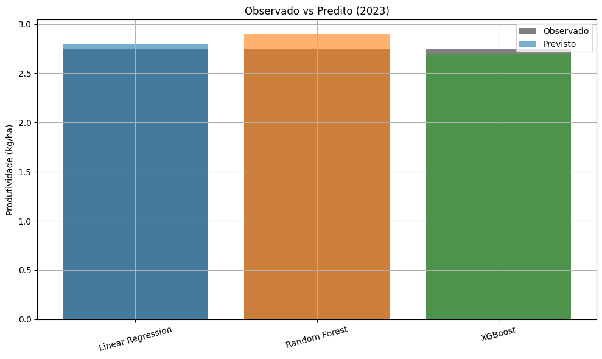
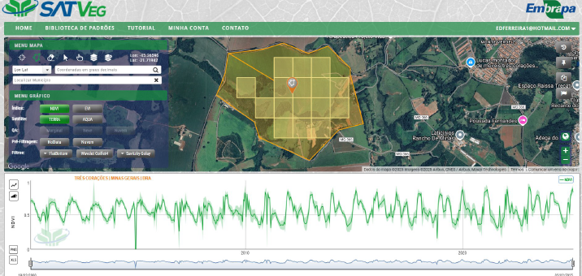

# FIAP - Faculdade de Informática e Administração Paulista

<p align="center">
<a href="https://www.fiap.com.br/"></a>
</p>

---

# Enterprise Challenge - Sprint 2 - Ingredion

### Fase 6

---

## 👨‍🎓 Integrantes:

- [Edmar Ferreira Souza](https://www.linkedin.com/in/)
- [Alexandre Oliveira Mantovani](https://www.linkedin.com/in/alexomantovani)
- [Ricardo Lourenço Coube](https://www.linkedin.com/in/ricardolcoube/)
- [Jose Andre Filho](https://www.linkedin.com/in/joseandrefilho)

## 👩‍🏫 Professores:

- Tutor: [Leonardo Ruiz Orabona](https://www.linkedin.com/in/leonardoorabona)
- Coordenador: [André Godoi](https://www.linkedin.com/in/profandregodoi)

---

## 📌 Descrição do Projeto

Este repositório apresenta a **Sprint 2** do desafio proposto pela empresa **Ingredion**, que teve como objetivo o desenvolvimento de um modelo de Inteligência Artificial para previsão de produtividade agrícola, utilizando dados de NDVI, clima e produtividade histórica da cultura do café na região de **Três Corações – MG**.

---

## 📦 Entregas da Sprint 2

### 📈 Entrega Única – Modelagem e Análise de Produtividade com NDVI

📓 [`Notebook Sprint 2`](pipeline_previsao_produtividade.ipynb)

---

## 🧪 Documentação Técnica da Sprint 2

### 1️⃣ Preparação dos Dados

O processo de preparação envolveu:

- Leitura de dados históricos de NDVI via **SATVeg/Embrapa** em formato CSV.
- Tratamento e interpolação de dados climáticos diários via **INMET**.
- Padronização e seleção dos dados de produtividade (rendimento kg/ha) via **IBGE**.
- Reamostragem e interpolação linear de NDVI semanal.
- Agregação estatística anual: média, desvio padrão, máximo e mínimo.

O resultado foi um dataset unificado e normalizado, pronto para ser utilizado em modelos de aprendizado de máquina.

---

### 2️⃣ Justificativa da Escolha das Variáveis

As variáveis utilizadas como preditores foram:

- `ndvi_mean`, `ndvi_max`, `ndvi_min`, `ndvi_std` → capturam o vigor vegetativo ao longo do ano.
- `chuva_mm`, `temp_media` → refletem as condições climáticas anuais que impactam diretamente a produção.

A variável resposta foi:

- `prod_kg_ha` → produtividade anual da cultura de café (kg por hectare).

> Essas variáveis foram escolhidas por representarem de forma integrada os fatores ambientais e fisiológicos que determinam o rendimento da lavoura.

---

### 3️⃣ Justificativa do Modelo e Lógica Preditiva

Foram testados três modelos de regressão:

- 🔹 Regressão Linear
- 🔹 Random Forest Regressor
- 🔹 XGBoost Regressor

A escolha se baseou na simplicidade (Regressão Linear) e capacidade de modelar relações não lineares (Random Forest e XGBoost). Os modelos foram treinados com os dados de 2021 e 2022 e testados em 2023, simulando uma previsão realista.

---

### 4️⃣ Análises Exploratórias e Estatísticas

**Gráfico 1 – Sazonalidade NDVI por Mês**
Mostra os picos de vegetação no início do ano, e declínio no inverno:



**Correlação entre NDVI e Produtividade**
Correlação positiva moderada (r ≈ 0.34), confirmando o NDVI como preditor relevante:

**Gráfico 3 – Observado vs Predito (2023)**
Compara os valores previstos por cada modelo com o valor real observado:



---

### 5️⃣ Segmentação do Talhão via Imagem de Satélite

A imagem abaixo mostra a área monitorada (talhão) delimitada na plataforma SATVeg, utilizada para extrair os valores médios de NDVI:



Além disso, a curva abaixo apresenta a evolução do NDVI no período de 2021 a 2023, demonstrando ciclos vegetativos coerentes com o padrão da cultura do café:


> A segmentação foi feita de forma manual com base na visualização do talhão, e os dados utilizados refletem exclusivamente a área cultivada, atendendo ao objetivo da etapa.

---

### 6️⃣ Métricas e Avaliação dos Modelos

| Modelo            | MAE   | RMSE  | R²  |
| ----------------- | ----- | ----- | --- |
| Linear Regression | 0.567 | 0.567 | —   |
| Random Forest     | 0.560 | 0.560 | —   |
| XGBoost           | 0.578 | 0.578 | —   |

_Nota: Como o teste foi feito com um único ponto (ano 2023), o R² não é aplicável._

---

## 🗂️ Estrutura do Projeto

```
📦 1TIAOR20242_FASE6_CAP1
│
│── 📁 assets
│   ├── 📄 logo-fiap.png
├── 📁 files
│   ├── 📄 INMET_SE_MG_A515_VARGINHA_01-01-2021_A_31-12-2021.CSV
│   ├── 📄 INMET_SE_MG_A515_VARGINHA_01-01-2022_A_31-12-2022.CSV
│   ├── 📄 INMET_SE_MG_A515_VARGINHA_01-01-2023_A_31-12-2023.CSV
│   ├── 📄 ndvi_tres_coracoes.csv
│   ├── 📄 ndvi_tres_coracoes.png
│   ├── 📄 producao_cafe_tres_coracoes.csv
│   ├── 📄 talhao.png
├── 📄 pipeline_previsao_produtividade.ipynb
├── 📄 pipeline_previsao_produtividade.py
├── 📄 README.md
└── 📄 requirements.txt
```

---

## ▶️ Youtube

<p align="center">
<a href= "https://youtu.be/oXkG2Uig_yw"></a>
</p>

---

## ✅ Requisitos para Execução

- Python 3.10+
- scikit-learn
- pandas
- matplotlib
- xgboost
- jupyterlab ou Google Colab

Instale via:

````bash
pip install -r requirements.txt


### ✅ Requisitos
Antes de tudo, instale as dependências listadas no arquivo `requirements.txt`:

```bash
pip install -r requirements.txt
````

> Obs.: O projeto detecta automaticamente se está no Colab ou local e adapta os caminhos conforme o ambiente.

---

## 📝 Licença

<p xmlns:cc="http://creativecommons.org/ns#" xmlns:dct="http://purl.org/dc/terms/">
Este projeto segue o modelo FIAP e está licenciado sob 
<a href="http://creativecommons.org/licenses/by/4.0/?ref=chooser-v1" target="_blank" rel="license noopener noreferrer">Attribution 4.0 International (CC BY 4.0)</a>.
</p>
